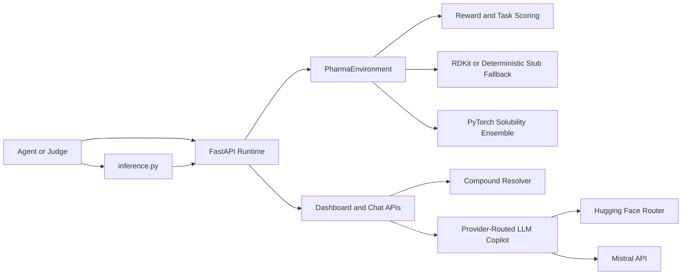
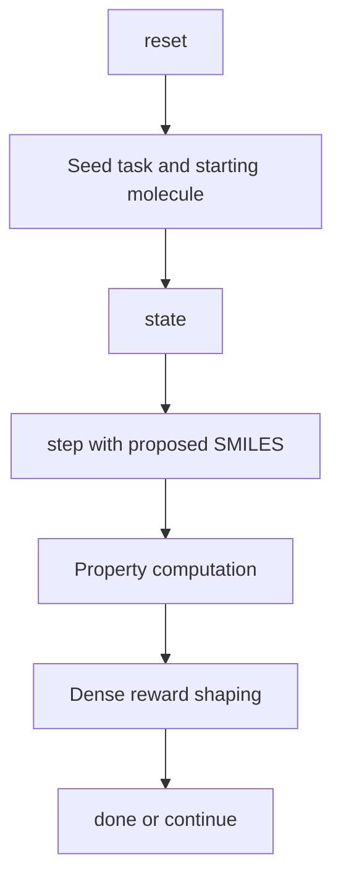

# PharmaOS

PharmaOS is an OpenEnv environment for real-world drug discovery work. An agent acts like a medicinal chemist: it proposes new SMILES strings, receives dense feedback from RDKit-based property calculations, and must improve drug-likeness without collapsing into invalid, repetitive, or assay-interfering molecules.

This repository is built for the Meta x PyTorch OpenEnv hackathon and is designed to satisfy the submission requirements end to end:
- 3 tasks with increasing difficulty
- typed Pydantic action, observation, and state models
- deterministic graders and dense rewards
- `openenv.yaml`
- root-level `inference.py`
- Docker deployment path
- local validation and launch scripts

Built by Team Fullstack Shinobi:
- Leader and developer: Soumoditya Das
- Member: Rajashri Choudhuri

## Architecture Visual





## Why this environment is real-world

PharmaOS models work that medicinal chemists actually do during hit-to-lead and lead optimization:
- improving oral drug-likeness
- balancing multiple ADMET and developability constraints
- avoiding PAINS motifs and repeated local optima
- making tradeoffs between potency-adjacent similarity, synthesis ease, permeability, and safety proxies

The reward is grounded in real cheminformatics computations rather than toy heuristics alone:
- Lipinski Rule of Five
- QED
- synthetic accessibility
- ESOL-style solubility
- BBB proxy scoring
- hERG risk proxy
- PAINS filtering
- scaffold diversity tracking

The dashboard also includes a smart compound resolver for exact compounds, common names, aliases, and broad product classes such as `detergent`, `bleach`, and `sunscreen`.

## Tasks

| Task | Difficulty | Goal | Success threshold | Max steps |
| --- | --- | --- | --- | --- |
| `lipinski_optimizer` | easy | satisfy Lipinski constraints for oral drug-likeness | `1.00` | `10` |
| `qed_optimizer` | medium | maximize QED while avoiding PAINS penalties | `0.75` | `15` |
| `multi_objective_designer` | hard | optimize QED, SA, similarity, and ADMET jointly | `0.70` | `20` |

Each task has a deterministic programmatic scorer in [server/environment.py](server/environment.py).

## Action space

The action model is defined in [models.py](models.py).

```python
PharmaAction(
    smiles: str,
    reasoning: str = "",
    metadata: dict[str, Any] = {},
)
```

The agent proposes a new SMILES string each step. Invalid or repeated proposals are penalized.

## Observation space

The observation model is also defined in [models.py](models.py) and includes:
- current SMILES
- molecular properties
- ADMET summary
- dense natural-language feedback
- step count
- best score so far
- recent history
- optional molecule SVG rendering

Important property fields include:
- `molecular_weight`
- `logp`
- `hbd`
- `hba`
- `tpsa`
- `qed`
- `sa_score`
- `logS`
- `bbb_score`
- `herg_risk`
- `pains_alert`
- `fingerprint_similarity`
- `composite_score`

## Reward function

Rewards are shaped at every step, not only on completion.

For a valid novel molecule:

```text
reward = score_improvement + 0.02 novelty_bonus + 0.05 new_scaffold_bonus - 0.15 pains_penalty
```

Other cases:
- repeated molecule: `-0.05`
- invalid SMILES: `-0.10`
- episode end: triggered by success threshold or max steps

This gives useful feedback across the trajectory while penalizing loops, invalid actions, and low-quality chemistry.

## Project layout

```text
pharma-os/
|-- client.py
|-- inference.py
|-- launch_dashboard.ps1
|-- models.py
|-- openenv.yaml
|-- train_ppo.py
|-- PharmaOS_PPO_Colab.ipynb
|-- COLAB_T4_GUIDE.md
|-- DRUG_DISCOVERY_RESEARCH.md
|-- scripts/
|   |-- preflight.py
|   `-- validate-submission.sh
|-- server/
|   |-- app.py
|   |-- environment.py
|   |-- agent.py
|   `-- ml_engine.py
`-- tests/
```

## Quick start

### Judge quick run

If you want the fastest judge-style verification path from a clean checkout:

```bash
python -m pip install -r requirements.txt
python -m pytest -q
python -m openenv.cli validate .
python scripts/preflight.py
```

That single preflight flow:
- starts the runtime
- validates `/reset`, `/step`, `/state`, and compatibility endpoints
- runs `inference.py`
- checks the structured `[START]`, `[STEP]`, `[END]` logs
- opens the dashboard endpoint at `/web`

### One-command launch on Windows

From PowerShell in the project root:

```powershell
./launch_dashboard.ps1
```

That script:
- installs dependencies
- runs `pytest`
- runs `openenv validate .`
- starts the local server on `127.0.0.1:8000`
- validates the live runtime
- runs the inference smoke baseline
- opens the dashboard

### Manual local run

```bash
python -m pip install -r requirements.txt
python -m pytest -q
python -m openenv.cli validate .
python -m server
python -m openenv.cli validate --url http://127.0.0.1:8000
```

Dashboard:

```text
http://127.0.0.1:8000/web
```

Live deployment:

```text
Space page: https://huggingface.co/spaces/soumod000575/pharma-os
Runtime host: https://soumod000575-pharma-os.hf.space
Dashboard: https://soumod000575-pharma-os.hf.space/web
```

## Inference script

The hackathon baseline script is [inference.py](inference.py).

Required environment variables:
- `API_BASE_URL`
  default: `https://router.huggingface.co/v1`
- `MODEL_NAME`
  default: `Qwen/Qwen2.5-72B-Instruct`
- `API_KEY`
  required in judge/validator environments
- `HF_TOKEN`
  optional backward-compatible fallback for local runs
- `LOCAL_IMAGE_NAME`
  optional: reserved for Docker-image based runners
- `PHARMAO_URL`
  default: `http://localhost:8000`

The script:
- uses the OpenAI client for LLM calls
- emits only `[START]`, `[STEP]`, and `[END]` lines on stdout
- includes `score=` in the final line
- uses deterministic task seeds `101`, `202`, and `303` for reproducibility
- falls back to a deterministic curated medicinal-chemistry policy if the external LLM is unavailable

Example:

```bash
export API_BASE_URL=https://router.huggingface.co/v1
export MODEL_NAME=Qwen/Qwen2.5-72B-Instruct
export API_KEY=your_token_here
export PHARMAO_URL=http://127.0.0.1:8000
python inference.py
```

## Chat Copilot Providers

The dashboard copilot in `POST /api/chat` and `POST /api/reasoning_trace` supports a provider-routed setup:

- Hugging Face Router via `HF_TOKEN`, `API_BASE_URL`, and `MODEL_NAME`
- Mistral failover via `MISTRAL_API_KEY`, `MISTRAL_API_BASE_URL`, and `MISTRAL_MODEL_NAME`
- `LLM_PROVIDER=auto|huggingface|mistral|off`

Default behavior:

- `auto`: try Hugging Face first, then Mistral, then fall back to local RAG and compound resolution
- `huggingface`: use only the HF Router backend
- `mistral`: use only the Mistral backend
- `off`: disable external LLM calls and keep the copilot fully local

Runtime wiring can be inspected without exposing secrets via:

- `GET /api/runtime_status`
- `GET /health`

The molecule viewer is also resilient in deployment:

- primary 2D render: server-provided RDKit SVG
- backup 2D render: RDKit-generated mol block rendered in-browser
- final 2D fallback: free PubChem PNG for recognizable public structures
- primary 3D render: RDKit ETKDG conformer coordinates
- backup 3D render: RDKit 2D coordinates projected into the live 3D viewer

## Verified local baseline

Verified on April 8, 2026 by running:

```bash
python scripts/preflight.py --keep-server
```

Result:

| Task | Steps | Final score | Success |
| --- | --- | --- | --- |
| `lipinski_optimizer` | `1` | `1.00` | `true` |
| `qed_optimizer` | `1` | `0.84` | `true` |
| `multi_objective_designer` | `4` | `0.78` | `true` |

These values came from the reproducible seeded smoke run that the preflight script executes locally.

## Docker and Hugging Face Spaces

Build locally:

```bash
docker build -t pharma-os .
docker run -p 7860:7860 pharma-os
```

For Hugging Face Spaces:
- use a Docker Space
- expose port `7860`
- tag the Space with `openenv`
- keep the Space in the Running state before submission

Suggested environment variables for the Space:
- `PORT=7860`
- `WORKERS=1`
- `PHARMAO_TASK=lipinski_optimizer`

## Training and Colab T4

The PPO baseline in [train_ppo.py](train_ppo.py) now uses a real Gymnasium wrapper around the actual PharmaOS environment. It does not use random rewards or a fake latent action space.

Train locally:

```bash
python train_ppo.py --task qed_optimizer --timesteps 5000 --device auto
```

Research-guided curriculum training:

```bash
python train_ppo.py --curriculum --timesteps 6000 --eval-episodes 3 --device auto
```

For Colab T4:
- see [COLAB_T4_GUIDE.md](COLAB_T4_GUIDE.md)
- use [PharmaOS_PPO_Colab.ipynb](PharmaOS_PPO_Colab.ipynb)

## Research grounding

The environment design and roadmap are summarized in [DRUG_DISCOVERY_RESEARCH.md](DRUG_DISCOVERY_RESEARCH.md).

Key ideas reflected in the current environment:
- multi-objective optimization instead of a single scalar property
- diversity-aware exploration rather than score hacking
- deterministic environment-side feedback instead of opaque reward models
- future extension path toward structure-aware and synthesis-aware objectives
- curriculum-ready PPO and diversity-aware baseline selection inspired by REINVENT, memory-assisted RL, and GuacaMol

## Validation helpers

Cross-platform preflight:

```bash
python scripts/preflight.py
```

POSIX helper:

```bash
bash scripts/validate-submission.sh
```

## Submission links

Required for the hackathon form:
- public GitHub repository URL for this project
- live Hugging Face Space URL
- note: the form expects a Space URL such as `https://huggingface.co/spaces/<user>/pharma-os`, not a model repo URL such as `https://huggingface.co/<user>/pharma-os`

Current Hugging Face profile:
- `https://huggingface.co/soumod000575`

Before submitting, update any placeholder repository or Space links in your public deployment metadata.

GitHub repository prepared for publish:
- `https://github.com/soumoditt-source/pharma-os`
